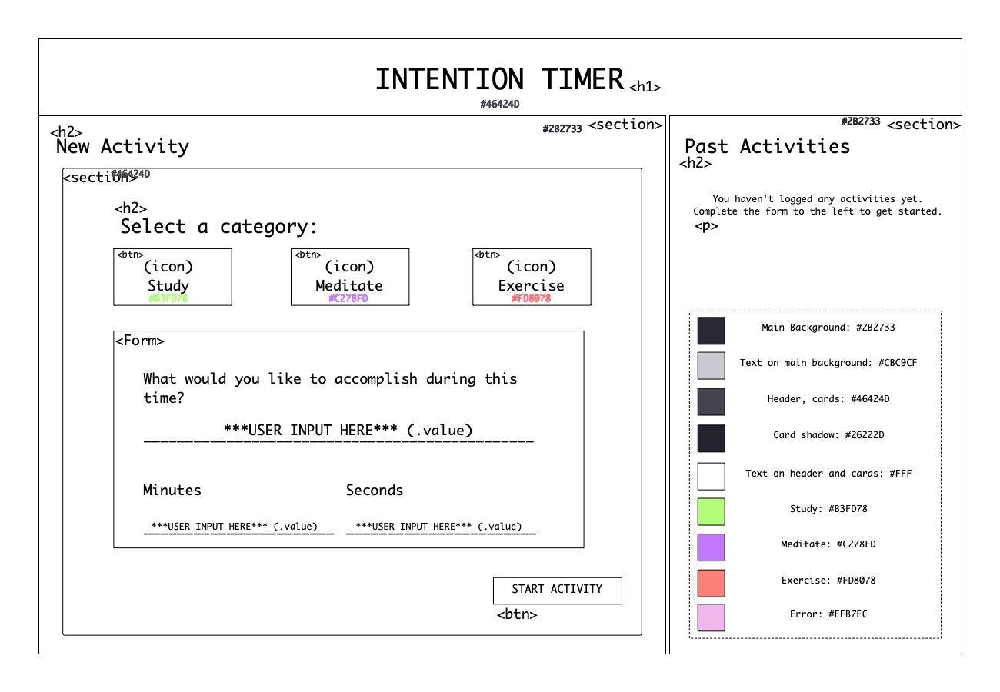
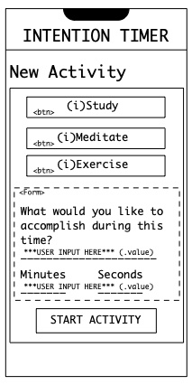
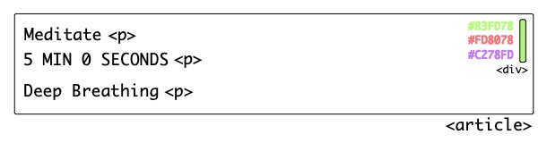
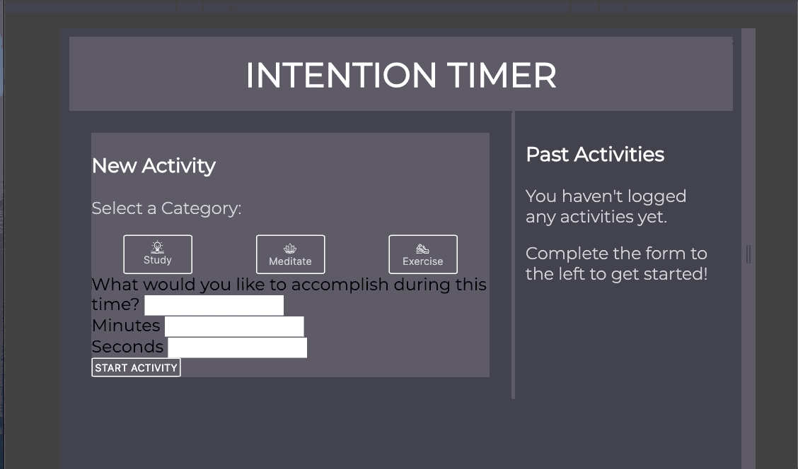
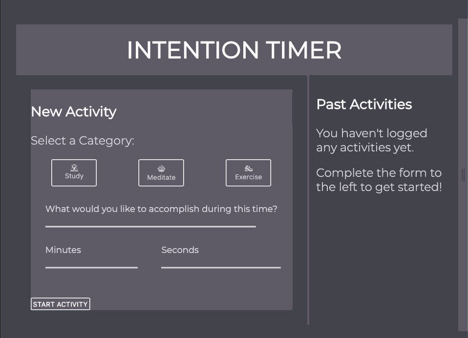
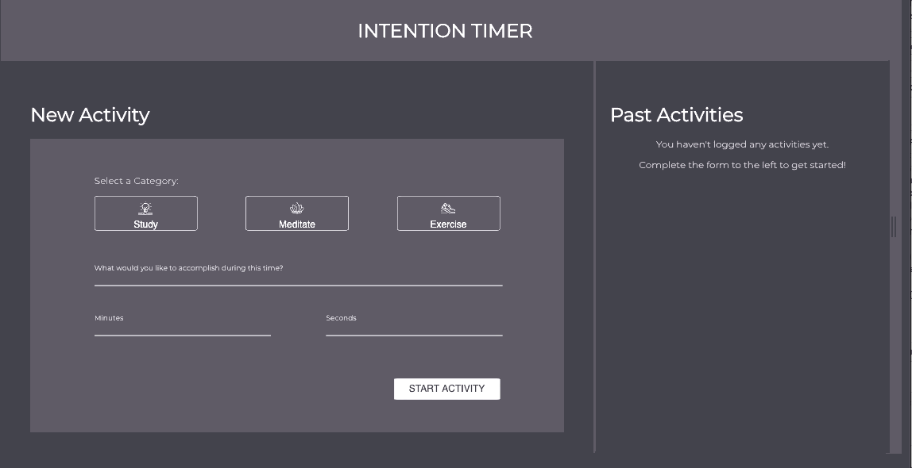
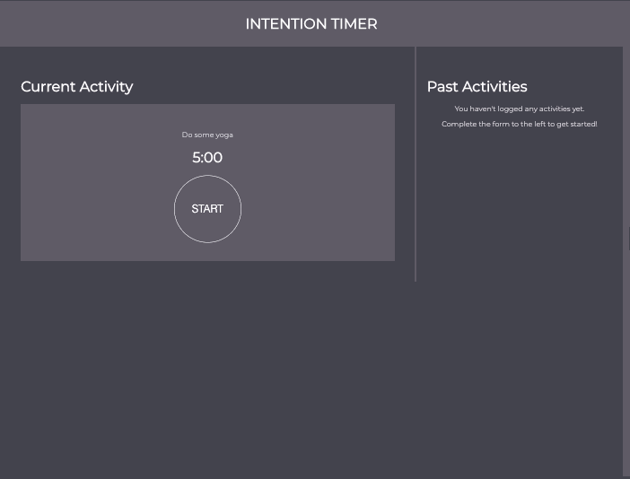

# 2005 FE Mod 1- Intention Timer (Group Project)
## Project Description
This project represents the collaborative efforts of Taryn Martin, Joe Varela, and Jake West. This is our first group project for the first module of the Turing Front End Program (Cohort 2005). We were asked to build an Intention Timer application that allows users to set time-boxed goals related to wellness & productivity. In practice, users select a category, describe a specific activity they want to complete, and use the built in timer to track their progress. By utilizing local storage, we *should* be able to provide the user with information about their behaviors over time.

As a group, we had to build this application from scratch! We were provided with static comp images for the entire site, as well as a color palette and font family. We were responsible for building the general HTML framework, applying CSS styling to it, and connecting this to our own JavaScript files to enable functionality. This project was broken into multiple iterations, each with unique requirements. The functionality we successfully built includes:
  1. Design layout with HTML and CSS
  2. Utilize an activity class in JavaScript
  3. Create a form in HTML to take in user input
  4. Construct a count down timer
  5. Display count down timer & user input
## Learning Goals
At the beginning of this project, we outlined a number of learning goals to act as our "guiding star" through this project. These are as follows:
  1. Gain a better understanding of writing clean and concise HTML & CSS
  2. Understand how Grid and Flex-Box can enhance responsivity
  3. Synthesize a working product from all the pieces (DOM, Data Model, JS, CSS & HTML) we've come across this module
  4. Develop our skills working and communicating as a group
## Project Status
  + 6/3/2020, 6:00 PM- We have just finished our first try at finishing iteration 3. There are several more things that need to be addressed before it is finalized. Look at next steps to see what needs to occur.
## Project Screenshots
1. Our wire-framed version of the website. We found that mapping out the wire frame with high detail gave us a stronger understanding of the html framework and css styling that needed to unfold.
  + 
  + 
  + 
2. As we refined our understanding of CSS and it's relationship to HTML, our application started taking shape!
  + 
  + 
  + 
3. This is the current activity view:
  + 
## Next Steps
  + Finish Iteration 3 
    - add 0 before seconds and minutes if the user input is low
    - Fix movement of start button during countdown
    - Cleaning up the timer display to look cleaner
  + Refactor code
  + Move onto iteration 4
## Reflection
Taryn - This project was really tough for me. There were some new concepts to learn how to use, and we were building a site from nothing! I definitely learned more about how to build a site from scratch, and how all of the little bits fit together. This was an amazing learning experience in seeing how HTML and CSS connect with JavaScript and how aspects need to be adjusted throughout the process to make sure everything works smoothly. I also learned a lot about working together, especially working remotely. I feel it was definitely harder to work remotely, because it is more time consuming to explain things to others. There isn't a screen handy for a person to point to, and sharing screens isn't the same as watching a person interact with the computer in person. I want to take what I have learned and refine and improve my skills and processes for projects in the future.

Jake- PHEW what a week. It's pretty amazing to know that 1.5 months ago I knew none of these tools & now we're writing our own CSS, HTML, and JavaScript to start building functional apps. It's exciting, overwhelming, and challenging! I'm excited to leave this project with a new understanding of these three langauges as parts; I learned how organization and precision is helpful for HTML, more about Grid and Flex-Box, and continue to see how powerful JavaScript is for linking these pieces together. A big challenge for me was learning more about group work flows; for our first project, we coded the entire thing together. This project was much more involved, so we had to find effective ways to split up tasks and learn to review/comment each other's code. There's a huge element of trust involved, as you all are relying on the individual contributions of each other to keep the project moving along. I look forward to carrying these invaluable interpersonal & technical skills into future projects.
## Links
  + Deployed Site: https://bjjdestroyer.github.io/intention-timer/
  + Taryn Martin GitHub: https://github.com/bjjdestroyer
  + Joe Varela GitHub: https://github.com/jobbotrock
  + Jake West GitHub: https://github.com/jkwest-93
